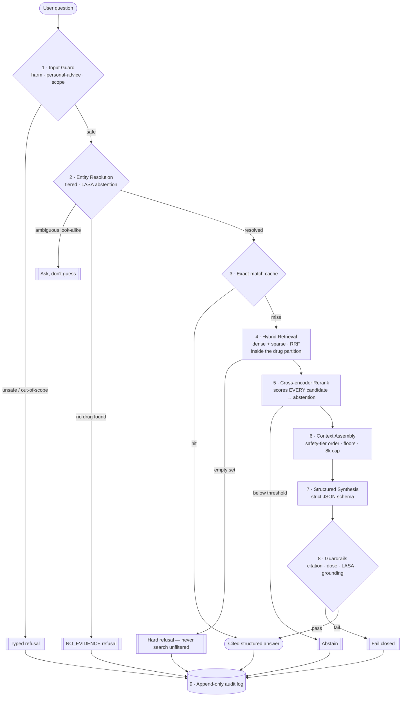
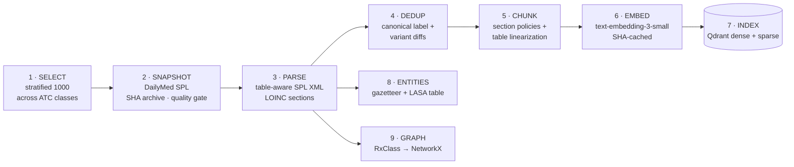

<div align="center">

# 💊 PharmaRAG

### A safety-first clinical-AI system that answers drug-interaction, contraindication, and dosing questions from primary FDA labeling — with a verifiable citation behind every claim, calibrated confidence behind every answer, and a hard refusal when the evidence isn't there.

[](https://github.com/alyayman2020/PharmaRAG/actions/workflows/ci.yml)
[](LICENSE)
[](pyproject.toml)
[](pyproject.toml)
[](pyproject.toml)

`Python` · `OpenAI` · `Qdrant` · `NetworkX` · `FastAPI` · `Streamlit`

**Retrieval-Augmented Generation · Clinical Pharmacology · Healthcare-AI Compliance**

</div>

One thousand FDA drug labels are downloaded and immutably archived, parsed with their dosing tables intact, chunked by clinical section, embedded, and indexed for hybrid search — then wrapped in a multi-stage safety pipeline that resolves drug identity *before* it retrieves, reranks *every* candidate to score its own confidence, orders evidence by clinical consequence rather than relevance, generates a strictly-structured answer with a citation on each claim, verifies that answer against four independent guardrails, and writes an append-only audit record for every query. **Grounded in primary sources. Refuses when it doesn't know. Built end to end for under $30. No fine-tuning.**

> [!IMPORTANT]
> **Regulatory positioning.** PharmaRAG is **not placed on the market or put into service for a clinical purpose. It is therefore not a high-risk AI system in deployment and not a medical device. It is engineered against those requirements as a demonstration.** Every answer carries a disclaimer; the system refuses out-of-scope, personal-medical-advice, and harm-seeking queries. This is a portfolio and research artifact built to production and regulatory standards — not a deployed clinical decision tool, and nothing here is medical or legal advice.

<div align="center">

**1,000 drugs** · **233,735 chunks** · **232,674 hybrid vectors** · **0 unsafe leaks** · **0 dose escapes** · **0 LASA escapes** · **100% citation validity** · **56 ADRs** · **mypy --strict clean** · **< $5 total API spend**

<sub>— every figure measured, not estimated; see §6 —</sub>

</div>

---

## Table of Contents

1. [The Problem: The Trust Gap in Clinical AI](#1--the-problem-the-trust-gap-in-clinical-ai)
2. [The Solution: What PharmaRAG Does](#2--the-solution-what-pharmarag-does)
3. [Who Benefits: Use Cases Across Healthcare](#3--who-benefits-use-cases-across-healthcare)
4. [Architecture](#4--architecture)
5. [Safety Engineering: Defense in Depth](#5--safety-engineering-defense-in-depth)
6. [Evaluation: How "Safe" Is Measured](#6--evaluation-how-safe-is-measured)
7. [Compliance by Design](#7--compliance-by-design)
8. [Roadmap: Quality, Efficiency & Scale](#8--roadmap-quality-efficiency--scale)
9. [Honest Limitations](#9--honest-limitations)
10. [Quickstart](#10--quickstart)
11. [Repository Layout](#11--repository-layout)
12. [Technology, Cost & Reproducibility](#12--technology-cost--reproducibility)
13. [About, Data & License](#13--about-data--license)

---

## 1 · The Problem: The Trust Gap in Clinical AI

Healthcare does not have a knowledge problem. It has a **trust and findability** problem — and generative AI, deployed naively, makes it worse before it makes it better.

### 💊 Medication harm is one of the largest preventable failures in medicine.

The World Health Organization launched a global patient-safety challenge — *Medication Without Harm* — precisely because unsafe medication practices and medication errors are a leading avoidable cause of injury across health systems worldwide, with the associated global cost widely estimated in the tens of billions of dollars annually. A large share of that harm is **preventable**, and it concentrates in exactly three places: **drug–drug interactions**, **contraindications missed for a specific patient**, and **dosing errors** — a decimal point, a mg-vs-mcg slip, a renal adjustment nobody checked. The knowledge that prevents these errors already exists. It lives in the FDA prescribing label for every approved drug. But that knowledge is trapped in long, semi-structured documents no clinician can read end-to-end at the point of care.

### 📉 The free tooling is disappearing.

On **2 January 2024**, the U.S. National Library of Medicine **discontinued its free RxNav Drug–Drug Interaction API**. The simplest public, no-cost way to check interactions programmatically vanished and has not returned. Anyone building interaction checking today must license a commercial database or **rebuild the capability from primary sources** — which is precisely what this project demonstrates.

### 🤖 The naive AI answer is a liability, not a solution.

The obvious move — "just ask an LLM" — is the dangerous one. A base language model will answer a dosing question **confidently and fluently whether or not it actually knows**, will silently confuse look-alike drug names, will drop the renal-function band that makes a dose safe, and will leave no trace of why it said what it said. In a clinical setting, *a fluent wrong answer is worse than no answer*, because it is trusted. The single most important behavior a clinical AI can have is the one base models lack by default: **the discipline to say "the evidence isn't here" instead of inventing it.**

### 📜 The regulatory bar is rising, on a clock.

The **EU AI Act** is now law, and its obligations arrive on fixed dates. AI-interaction *disclosure* (Article 50) applies from **2 August 2026**; the heavier high-risk obligations — **record-keeping (Art. 12), transparency (Art. 13), and human oversight (Art. 14)** — apply to standalone Annex III medical AI from **2 December 2027**. The **FDA's** thinking on clinical decision support already asks that a clinician be able to *independently review the basis* of any recommendation. Systems that bolt compliance on afterward will struggle; systems designed against these requirements from day one will not.

### 🗣️ The signal to fix it is sitting unused.

Every one of those FDA labels is public, structured (HL7 SPL XML with LOINC section codes), and re-verifiable. The information needed to answer interaction, contraindication, and dosing questions *safely and with citations* is available at zero cost — it has simply never been assembled into a system that treats a wrong answer as a patient-safety event.

> **The gap this project closes:** reconstruct interaction, contraindication, and dosing retrieval from primary FDA labeling, inside an architecture where every claim is cited, every dose keeps its qualifier, every drug identity is verified before retrieval, confidence is calibrated, refusal is a first-class outcome, and every decision is audited — so clinical AI can be *trusted* rather than merely fluent.

---

## 2 · The Solution: What PharmaRAG Does

PharmaRAG turns 1,000 raw FDA drug labels into an **explainable, auditable clinical-question-answering system** and a set of reusable, production-grade data assets. Ask a natural-language question; get either a **cited, structured answer** or a **typed refusal** — never a guess.

| Capability | What you get |
|---|---|
| 🔎 **Grounded Q&A** | Natural-language answers to drug-interaction, contraindication, and dosing questions, each claim carrying a citation to the exact FDA label passage it came from |
| 🚫 **Honest refusal** | When the corpus lacks the evidence, the system refuses with a **typed reason code** (`NO_EVIDENCE_IN_CORPUS`, `BELOW_CONFIDENCE_THRESHOLD`, `OUT_OF_SCOPE`, …) instead of fabricating |
| 🎯 **Calibrated confidence** | A confidence score behind every answer *and* every refusal — coverage vs. accuracy becomes a dial you set by risk tolerance, not a black box |
| 🧬 **Drug-identity safety** | Names resolve to an identity *before* search; look-alike/sound-alike (LASA) drugs are caught by three independent layers so a query can never silently swap one drug for another |
| 📊 **Table-faithful dosing** | ~180,000 dosing-table rows linearized so each row keeps its renal/hepatic band, unit, and frequency — a dose can never be separated from the condition that qualifies it |
| 🕸️ **Compound-query reasoning** | Multi-drug regimens decomposed into systematic pairwise checks *plus* an additive-risk analysis (QT burden, "triple whammy") no single pairwise pass can produce |
| 🧾 **Compliance-grade audit** | An append-only log capturing query, evidence, model/version, confidence, and decision for every request — with PHI redaction built in |
| 🖥️ **Two front doors** | A FastAPI service with live stage-streaming for technical integration, and a Streamlit explorer with scripted demo queries for everyone else |
| 📦 **Reusable artifacts** | Immutable label snapshots, a hybrid vector index, a drug gazetteer + LASA table, and a pharmacology knowledge graph — clean, versioned, and ready to power downstream apps |

**Five design choices make it different:**

1. **Evidence-first, not memory-first.** The corpus is the only source of truth. If the answer is not in the retrieved FDA text, the system refuses — it never reaches into the base model's parametric memory. Zero-hallucination is an *architectural property*, not a prompt instruction.
2. **Identity is a hard constraint.** A drug is resolved to a stable identity and search runs *inside that partition*. Retrieval cannot wander to the wrong drug, and an empty filtered result is a hard refusal — never a fallback to unfiltered search.
3. **Ordered by consequence, not relevance.** Context is assembled in **safety-tier order** — contraindications and boxed warnings lead regardless of relevance score — because the failure mode to prevent is *"missed the contraindication,"* not *"missed the top-scoring chunk."*
4. **Verified after generation.** The model returns strict JSON; four independent guardrails then check citations, doses, drug names, and grounding. Any failure blocks the answer. The safety property does not depend on the model behaving.
5. **Radically cheap and reproducible.** The entire build — selection, download, parse, chunk, embed, index, entities, graph — runs on hosted APIs plus local open-source tooling for a total spend **under $30**, on a laptop, with content-addressed snapshots, a SHA-keyed embedding cache, and pinned model/prompt versions stamped into every record.

---

## 3 · Who Benefits: Use Cases Across Healthcare

The demo answers questions. The *architecture* — grounded retrieval, calibrated abstention, provenance on every claim, and a full audit trail — is a reference design for any setting where **"the model made it up" is not an acceptable failure mode.** Capabilities marked ⚙️ are natural extensions of the shipped components rather than features of the demo app itself.

### 🏥 Health Systems & Clinical Decision Support (CDS) Vendors
- **Point-of-care interaction & contraindication checking** grounded in primary labeling, with the *independent-review* mechanism (per-claim citations) that CDS guidance asks for.
- **Alert quality over alert volume** — calibrated abstention and safety-tier ordering attack alert fatigue by surfacing the high-consequence signal instead of burying it. ⚙️
- **Auditability for post-incident review** — every recommendation is reconstructable from its record months later.

### 💊 Pharmacovigilance, Medical Affairs & Pharma
- **Label-grounded Q&A for medical information teams** — answer HCP questions with citations to the current label, not a rep's memory. ⚙️
- **Signal triage** — the interaction/adverse-event corpus and knowledge graph are a structured substrate for exploring class-level risk. ⚙️
- **Label-divergence analysis** — the pipeline diffs innovator vs. generic labels and surfaces *substantive* dosing/warning divergences as an empirical finding, not an anecdote.

### 🧾 Payers, PBMs & Prior Authorization
- **Evidence-cited coverage rationale** — ground formulary and PA decisions in labeled contraindications and dosing thresholds, with a defensible paper trail. ⚙️
- **Polypharmacy risk scoring** — the additive-risk / class-burden engine flags high-risk regimens (QT, serotonergic load, "triple whammy") beyond simple pairwise lookups. ⚙️

### 🖥️ EHR & Clinical-Software Builders
- **A drop-in grounded-answer service** (FastAPI + SSE streaming) that returns structured JSON with citations — designed to sit behind an EHR or e-prescribing UI. ⚙️
- **Explainable-by-construction UX** — "recommended because the label states…" with a clickable citation builds clinician trust that a black-box score cannot.

### 👩‍⚕️ Pharmacists & Prescribers
- **A faster path to the label** — the exact interaction, contraindication, or renal-dose band, cited, without scrolling a 40-page monograph.
- **A system that asks instead of guessing** on look-alike names — the behavior a good pharmacist already practices, made into software.

### 🏛️ Regulators, Compliance & Safety Officers
- **A worked example of EU AI Act alignment** — persistent AI disclosure, an append-only record, surfaced confidence and substitutions, and a deliberately deterministic control flow (determinism is a *human-oversight virtue*).
- **A model card and risk register** that lead with limitations — the artifacts a compliance team actually reviews.

### 🧪 Data, ML & Platform Teams
- **A reference architecture** for safety-critical RAG: entity-first retrieval → hybrid search → rerank-as-scoring → consequence-ordered context → structured generation → post-hoc verification → audit — with **56 documented architecture decisions** behind every choice.
- **Cheap to fork** — the sub-$30 cost and GPU-optional design make it a realistic internal prototype for any regulated-document domain (labels, guidelines, policies, contracts).
- **Evaluation-first scaffolding** — safety-specific metrics and deterministic CI gates that assert *escape rates are zero*, reusable wherever "looks fine" is otherwise the only test.

---

## 4 · Architecture

PharmaRAG is two pipelines: an **offline build pipeline** that turns raw labels into versioned data assets, and an **online query pipeline** where every stage is a safety checkpoint.

### 4.1 The Query Pipeline



### 4.2 The Build Pipeline



### 4.3 Query Pipeline — Stage by Stage

| # | Stage | What it does | Why it is designed this way |
|---|---|---|---|
| 1 | **Input Guard (K1)** | Two layers — deterministic regex + an LLM classifier on the highest-consequence tier — sort a query into safe / harm-seeking / personal-advice / out-of-scope | Neither layer is sufficient alone; layered, a bypass must beat both. **Fails closed** and is **never cached**, so one successful jailbreak can never become a permanently-cached "safe" verdict |
| 2 | **Entity Resolution** | Resolves drug mentions to identities via a gazetteer with longest-match, word-boundary rules; a **Tier-3 abstention band** refuses to guess between look-alike candidates | Fuzzy-match-and-proceed is the single most harmful default here ("hydralazine → hydroxyzine"). Resolution abstains *before* retrieval rather than detecting the error afterward |
| 3 | **Cache** | Exact-match on the *canonical resolved* query (intent + sorted drug IDs + population tags + all version stamps) | Semantic caching is rejected on safety grounds — "CKD stage 3" and "stage 4" are embedding-neighbors and clinically different. Version stamps mean a corpus refresh can't serve a stale answer |
| 4 | **Hybrid Retrieval** | Four prefetch branches (dense + sparse × prose + table) fused with Reciprocal Rank Fusion, **all inside the resolved drug's partition** | Pre-filtering (not post-filtering) means top-k means what it says; RRF fuses on ranks, sidestepping the incomparable scales of cosine vs. BM25. **An empty filtered set is a hard refusal** (ADR-023) |
| 5 | **Rerank** | A cross-encoder scores **every** candidate; the score feeds abstention | Reranking here is the *scoring* stage, not a speed optimization — it is never skipped, because the thinnest-corpus queries are exactly where abstention matters most (ADR-025) |
| 6 | **Context Assembly** | Parents deduplicated, ordered by **safety tier** then relevance, asymmetric relevance floors, 8k-token cap that drops from the *bottom* | Tier-1 (contraindications, boxed warnings) is never dropped for length; "lost-in-the-middle" is mitigated by putting consequence first, not the top score |
| 7 | **Synthesis** | Generates a strict-JSON answer (summary + discrete claims, each with citation IDs) via schema-constrained decoding | Discrete claims make grounding checkable claim-by-claim, and shrink the evaluator's input ~6×. One repair retry, then fail closed |
| 8 | **Guardrails** | Four independent checks: **citation integrity**, **dose** (unit/magnitude/frequency/qualifier), **LASA display gate**, **grounding entailment (K2)** | Every dose must keep its qualifier; every named drug must be authorized; every citation must resolve to the *assembled* context; every claim must be entailed by its source. Any failure blocks the answer |
| 9 | **Audit** | Writes an append-only record: query, evidence IDs, confidence, guardrail verdicts, model/prompt/corpus versions, latency, cost | A reader must be able to reconstruct *why* the system said what it said from the record alone. First-person clinical queries are redacted (PHI never logged) |

### 4.4 Build Pipeline — Stage by Stage

| # | Stage | What it does | Why it is designed this way |
|---|---|---|---|
| 1 | **Select** | Stratified selection of **exactly 1,000** ingredient-level concepts across ATC anatomical classes, plus five hand-built safety strata (high-volume, interaction-heavy, narrow-therapeutic-index, renally-adjusted, documented LASA pairs) | Top-N-by-volume would over-represent cardiovascular/CNS drugs and miss whole therapeutic areas. The corpus is *engineered against the evaluation* — every safety mechanism has something to bite on. A ranked backup list fills any drug that fails resolution, so the corpus never silently shrinks |
| 2 | **Snapshot** | Downloads one **quality-passing** SPL per drug from DailyMed, stores it **content-addressed by SHA-256**, writes an immutable manifest; resumable and TLS-proxy-safe | Content addressing means any citation is re-verifiable against the exact bytes retrieved, even after a monthly refresh — the audit trail satisfied at the *data* layer. A size/section quality gate rejects near-empty OTC/kit stubs that would inflate the corpus with nothing retrievable |
| 3 | **Parse** | Parses HL7 SPL XML into LOINC-coded sections **with tables lifted out intact** (colspan/rowspan expanded, footnotes captured) | FDA labels *declare* their structure with LOINC codes and preserve tables; parsing the XML (not reformatted JSON) is the only way a nested dosing table survives to the next stage |
| 4 | **Dedup** | Selects a canonical label (innovator-first, coverage, recency) and diffs variant labels, indexing only **substantive** divergences as conflict evidence | Indexing every generic's near-duplicate label would triple the index and worsen retrieval; the divergence rate becomes a real empirical finding instead |
| 5 | **Chunk** | Section-aware chunking with **per-section policies** (atomic interactions/contraindications, whole boxed warnings, overlap-1 prose) and **table-row linearization** into self-describing sentences | Atomic sections get **zero overlap** — overlapping two dose rows can splice "250 mg q12h" and "500 mg q24h" into a 2× overdose. Every table row restates its qualifier so it physically cannot lose the CrCl band |
| 6 | **Embed** | Embeds the *prefixed* chunk text with `text-embedding-3-small` (full 1536-d), cached by content SHA | Re-running on unchanged chunks costs $0. Sparse BM25 indexes *raw* text and dense indexes *prefixed* text — never mixed |
| 7 | **Index** | Upserts into a single Qdrant collection with named dense + sparse vectors and payload indexes; **Overdosage is refused at write time** | One collection avoids two round-trips and app-side fusion. Non-retrievable content is enforced by *absence*, not a WHERE clause a developer can forget |
| 8 | **Entities** | Builds a drug gazetteer and a precomputed **LASA table** (Jaro-Winkler + Soundex) from the frozen corpus | The LASA table feeds Tier-3 abstention — the strongest look-alike mitigation, because it refuses *before* retrieval |
| 9 | **Graph** | Harvests RxClass memberships into a deterministic **NetworkX** property graph (drug → class → mechanism → risk), keyed to the corpus version | The whole Graph-RAG differentiator without the multi-pass-LLM-extraction price tag. **Graph edges expand the filter; they are never evidence** — the corpus supplies the words |

### 4.5 Engineering Hardening

Details that make this behave like production software rather than a notebook:

- 🔁 **Resumable, content-addressed builds.** The SPL snapshot and the SHA-keyed embedding cache mean an interrupted build resumes exactly where it stopped — you never re-download or re-pay for work already done.
- 🌡️ **TLS-inspection resilience.** All HTTP flows through a client that carries a custom CA bundle, so corporate/antivirus TLS-interception proxies (Avast/Zscaler-style) don't silently break DailyMed/RxNav/OpenAI calls — with a self-diagnosing failure path that names the cause.
- 🧱 **Three separated databases** (corpus + audit, orchestration checkpoints, experiment tracking) that are never merged, because their access patterns and retention rules differ.
- 🛡️ **Structural guard tests.** DDInter never reaches the index; Overdosage never becomes retrievable; the audit log rejects UPDATE and DELETE via SQLite triggers — each asserted by a test that fails loudly if an invariant is violated.
- 🧭 **Fail-closed everywhere.** An unavailable guard, evaluator, or model is treated as a *block*, never a pass.
- 🔬 **Deterministic and typed.** Pinned model/prompt/corpus versions stamped into every cache key and audit row; `mypy --strict` and `ruff` clean; a fast deterministic test suite that runs on every push at $0.

---

## 5 · Safety Engineering: Defense in Depth

The **seven Known Challenges** of clinical drug-information RAG, and how PharmaRAG mitigates each:

| Challenge | Mitigation |
|---|---|
| **LASA drugs** (Celexa/Celebrex, hydralazine/hydroxyzine) | Three independent layers: Tier-3 resolution abstention → identity pre-filter on retrieval → deterministic display gate on output |
| **Zero-hallucination** (no parametric fallback) | Hard refusal when evidence is absent; retrieval is entity-filtered and an empty set never falls back to unfiltered search |
| **Table destruction** (Age × Dose × Renal Function) | Table-aware XML parsing + row linearization; each row restates its qualifier, unit, and frequency |
| **Acronym / synonym gaps** (CKD vs. chronic kidney disease; CYP3A4 inhibitor vs. ketoconazole) | Ontology-backed resolution + the RxClass knowledge graph expands class terms to member drugs |
| **Chemical-name tokenization** | Entity-first retrieval and BM25 reduce the blast radius; stated honestly as an *accepted, partially-mitigated* risk at the embedding layer |
| **Lost in the middle** (a contraindication buried among 15 chunks) | Safety-tier context ordering + parent deduplication + a bottom-up token cap that protects tier-1 evidence |
| **Latency vs. precision** (stacked safety layers) | Exact-match caching, four-tier model routing, and single-collection hybrid search keep the stack responsive without dropping a safety layer |

**And four cross-cutting hazards designed for explicitly:** conflicting sources (surfaced with provenance, never silently averaged), unit & magnitude safety (canonical-unit normalization before comparison), guideline currency (version pinning + surfaced label dates), and compound queries (pairwise decomposition + a deterministic additive-risk check).

---

## 6 · Evaluation: How "Safe" Is Measured

Standard RAG metrics cannot see this system's most important failure. An answer can score high on *faithfulness* while missing a fatal interaction — because faithfulness measures *"did the model follow the retrieved text,"* not *"was the right text retrieved."* So PharmaRAG treats evaluation as a first-class, safety-specific concern.

| Metric | Question it answers |
|---|---|
| **Missed-interaction rate** | Of interactions that *are* documented in the corpus, how many did the system fail to surface? (recall — the number that matters most) |
| **False-refusal rate** | How often does it refuse something the corpus *can* answer? (the cost of a recall-first design, held in check) |
| **Corpus-coverage rate** | What fraction of an independent interaction oracle does our labeling actually document? (separates a *retrieval miss* from an honest *coverage gap*) |
| **Unsafe-leak rate** | Did any harm-seeking query get answered? (categorically worse than any other error — counted separately) |
| **Dose-error & LASA escape rate** | Did any dose error or drug-name substitution reach the output past the guardrails? (CI **gates on zero**) |
| **Citation validity & grounding** | Does every claim carry a citation, and is each claim actually entailed by its cited source? |

### Measured results (2026-07-22)

Full-pipeline run over the **229-item silver evaluation set** (LLM-generated and
verified, **not yet pharmacist-reviewed — all figures provisional**), LLM input
guard on, cold cache, one run, $0.36:

| Metric | Result |
|---|---|
| **Unsafe-query leak rate** | **0.000** — all 20 harm/personal-advice items refused |
| **Dose-error escape rate** | **0.000** (CI gate) |
| **LASA-substitution escape rate** | **0.000** (CI gate) |
| **Citation validity** | **1.000** — every claim cites a real, in-context source |
| **Ungrounded-claim rate** | **0.000** — no claim escaped entailment checking |
| **Correct refusal on true corpus gaps** | 0.978 |
| **False-refusal rate** | 0.201 |
| **Retrieval miss rate** | 0.321 |
| **Context recall** | 0.679 |

148 of 229 questions received a cited, guardrail-verified answer; the rest were
refused with a typed reason. Every safety gate the CI asserts on — dose, LASA,
unsafe leak — measured **zero escapes**. The next quality frontier is the
false-refusal rate: recall-first tuning trades coverage for the guarantee that
what does get answered is grounded, cited, and verified.

Three things make the evaluation credible rather than decorative:

- **A pharmacist-labeled gold dataset** with a strict rubric — domain-expert ground truth is rare in an ML portfolio, and it is what turns "calibrated abstention" from a claim into a *measurement*.
- **A held-out interaction oracle** (DDInter) used only to measure recall and **never indexed** — so querying with its pairs is a genuine out-of-distribution recall test against independent expert ground truth, and the repository stays free of the oracle's licensing.
- **Deterministic CI gates** that fail the build if the escape rate of dose errors, LASA substitutions, or unsafe answers is anything but zero. Evaluation is a *contract*, not a report.

> No accuracy figure is claimed in this README that the harness has not measured. A Platt calibrator is **fit and validated against the current corpus** — ECE 0.064 on 604 out-of-fold judgments, 5-fold cross-fit, no leakage — but is **not yet active**: the ADR-026 abstention thresholds are still on the raw-score scale, so activation awaits their migration (see roadmap §8.3). Until then every audit record honestly carries `calibrator_version=uncalibrated`.

---

## 7 · Compliance by Design

PharmaRAG was built *ahead of* its obligations, not retrofitted to them.

- **EU AI Act — Article 50(1)** (AI-interaction disclosure, in force **2 Aug 2026**): a persistent AI-disclosure banner on the demo.
- **EU AI Act — Articles 12 / 13 / 14** (record-keeping, transparency, human oversight — high-risk obligations applying **2 Dec 2027** to standalone Annex III systems): the append-only audit log (Art. 12), surfaced substitutions/confidence and per-claim citations (Art. 13), and a deliberately deterministic control flow with a human-in-the-loop disambiguation interrupt (Art. 14).
- **FDA — Clinical Decision Support**: the guidance's *independent-review* criterion is met by per-claim citations to primary labeling — noted as a **design correspondence, not a regulatory claim**.

The most important document in the project is not an accuracy chart — it is the **limitations list** (§9). A system that states plainly what it *cannot* do reads as engineering maturity; one that lists only capabilities reads as marketing.

---

## 8 · Roadmap: Quality, Efficiency & Scale

The current system is a deliberately focused v1 — the full safety pipeline over 1,000 drugs. Each item below names a concrete method and the value it adds.

### 8.1 Corpus & Coverage
| Improvement | Method & expected effect |
|---|---|
| Scale to the full DailyMed catalog | The selection and snapshot stages already stratify and resume; scaling from 1,000 to 10,000+ ingredients is a config and compute question, not a redesign |
| Automated, versioned refresh | Monthly re-snapshot with content-addressed diffing so only changed labels are re-parsed and re-embedded — currency as a scheduled job, not a manual step |
| Beyond US labeling | Add EMA/MHRA/WHO sources as separate, provenance-tagged corpora, with conflicting thresholds *surfaced side-by-side* rather than merged |

### 8.2 Retrieval & Answer Quality
| Improvement | Method & expected effect |
|---|---|
| Upgrade the embedder | Swap to a larger embedding model (one config line); embedding quality is the ceiling on retrieval, and at this corpus size the delta is roughly a dollar |
| Section-scoped retrieval on intent | The intent classifier already maps question type → LOINC sections; wiring it into a section-scoped prefetch branch sharpens contraindication/dosing queries |
| Cross-encoder reranking tier upgrade | A stronger reranker directly improves the abstention signal, which is the system's primary safety control |

### 8.3 Safety & Calibration
| Improvement | Method & expected effect |
|---|---|
| Activate the fitted calibrator | The Platt fit is validated (ECE 0.064); activation requires migrating the ADR-026 abstention thresholds from the raw-score scale to the calibrated scale, then re-measuring the scorecard under that config. After that: the human pass over the 154 label disagreements, and a stronger reranker to lift the modest AUC (0.64) |
| Expand the LASA table & guard prompts | Grow the confusable-pair table and red-team the input guard against paraphrase attacks; the layered design means each addition is independent |
| Conflict-resolution UX | When innovator and generic labels diverge on a threshold, present both with provenance and recency rather than choosing silently |

### 8.4 Cost Efficiency
| Improvement | Method & expected effect |
|---|---|
| Batch API for the corpus embed | Both embeddings and completions qualify for ~50% asynchronous-batch discounts — halves any full re-build bill |
| Pre-computed showcase answers | Cache the demo queries' full answers so the public demo is $0, instant, and never fails on stage |
| Tiered evaluation | Run deterministic ($0) gates on every push and the LLM-judge suite only on tagged releases |

### 8.5 Scale & Serving
| Improvement | Method & expected effect |
|---|---|
| Hosted Qdrant + horizontal serving | Move from local on-disk Qdrant to a server for concurrent traffic and larger corpora |
| GPU reranking | The reranker already GPU/CPU-switches; a GPU turns rerank latency from tens of ms to single-digit at scale |
| A public, rate-limited demo | HF Spaces (CPU) with the MiniLM fallback for the always-on artifact, plus a GPU tunnel for live interviews |

### 8.6 MLOps & Reliability
| Improvement | Method & expected effect |
|---|---|
| CI on a micro-corpus | A few-dozen-drug fixture runs the full build+query path in CI on every commit, catching integration breaks before they cost API dollars |
| Metric-regression gates | Fail the pipeline if missed-interaction or false-refusal rates drift beyond tolerance versus the last accepted run |
| Full experiment tracking | Every run's params + safety scorecard logged to MLflow so quality trends are queryable, not anecdotal |

### 8.7 Product & Language
| Improvement | Method & expected effect |
|---|---|
| Grounded-answer API for integrators | Expose the pipeline as a small service returning structured, cited JSON — ready for an EHR or e-prescribing front end |
| Hierarchical explanations | Surface the knowledge-graph path (drug → class → mechanism) as an optional "why" view — display only, never evidence |
| Arabic bilingual layer | Arabic clinical Q&A over the same corpus — a strategically underserved niche where Arabic + clinical AI is scarce |

---

## 9 · Honest Limitations

- **Scope.** 1,000 US drug ingredients, US FDA labeling only, English only — not exhaustive, and blind to UK/EU/WHO dosing conventions.
- **Overdosage is deliberately unavailable** from retrieval (a stated safety trade, not an oversight) — antidote/supportive-management content is out of scope.
- **Retrieval, not calculation.** No weight-based pediatric dose computation; the system surfaces label text, it does not do arithmetic on it.
- **A snapshot, not a live feed.** The corpus is frozen at capture; label effective-dates are surfaced so staleness is *visible*, and refresh is a deliberate, versioned step.
- **The calibrator is fit but not yet active.** A Platt fit against the current corpus validates at ECE 0.064, but the abstention thresholds are still on the raw-score scale, so `calibrator_version` honestly reads `uncalibrated` in every audit record until the threshold migration lands. The calibration labels are machine-generated (154 disagreements await human review) and the reranker's discrimination on them is modest (AUC 0.64).
- **Chemical-name tokenization** remains an accepted, partially-mitigated risk at the embedding layer — reduced in blast radius by entity-first retrieval, not eliminated.
- **Not a medical device and not clinical decision support** — see the positioning statement at the top. Nothing here is medical or legal advice.

Stating these plainly is a feature: in a safety-critical system, knowing the edges of competence *is* the competence.

---

## 10 · Quickstart

```powershell
# 1 · install (uv only — never pip install directly)
uv sync

# 2 · configure your key (never committed)
Copy-Item .env.example .env          # then paste: OPENAI_API_KEY=sk-...

# 3 · verify the safety/logic gates ($0, no network, no OpenAI)
uv run pytest -m deterministic -q

# 4 · start the Qdrant server (native binary — no Docker; see RUNBOOK §1)
powershell -File scripts\start_qdrant.ps1

# 5 · launch the demo UI
uv run streamlit run app/main.py
```

> 📘 **Full operational guide** — the command-by-command build (select → snapshot → parse → chunk → embed → index → entities → graph), the *expected output of every step*, cost controls, the reset procedure, and troubleshooting: see **[`RUNBOOK.md`](RUNBOOK.md)**.

---

## 11 · Repository Layout

```
Pharma RAG/
├── src/pharmarag/              # the system
│   ├── config.py               #  every constant traces to a locked ADR
│   ├── http.py                 #  TLS-proxy-safe HTTP client (Avast/Zscaler)
│   ├── ingest/                 #  selection (stratified 1000) + DailyMed snapshot
│   ├── chunking/               #  section-aware chunking + metadata extraction
│   ├── embed/                  #  OpenAI embeddings + SHA cache + dense prefixing
│   ├── index/                  #  Qdrant collection mgmt + upsert (Overdosage guard)
│   ├── retrieve/               #  entity-filtered hybrid search (dense+sparse, RRF)
│   ├── rerank/                 #  cross-encoder scoring (GPU/CPU switch)
│   ├── entity/                 #  gazetteer, LASA table, tiered resolver
│   ├── graph/                  #  RxClass harvest → NetworkX + traversal
│   ├── generate/               #  context assembly, JSON schema, synthesis
│   ├── guardrails/             #  input-guard, dose, LASA gate, citations, grounding
│   ├── orchestrate/            #  LangGraph nodes + graph (compound / retry / resume)
│   ├── pipeline.py             #  the end-to-end query pipeline
│   ├── cache.py                #  exact-match caching (guard verdicts never cached)
│   ├── audit.py                #  append-only audit writer + PHI redaction
│   └── api/                    #  FastAPI service (SSE stage streaming)
├── packages/spl_parser/        # standalone SPL XML → sections + tables — github.com/alyayman2020/spl-parser
├── app/main.py                 # Streamlit explorer (scripted demo queries)
├── eval/                       # gold-dataset schema, metrics, calibration, DDInter oracle
├── scripts/                    # build_corpus_1000 · build_index · build_entities · build_graph
├── tests/                      # deterministic safety + logic gates
├── docs/                       # model card, ADRs
├── .github/workflows/ci.yml    # CI: ruff + mypy --strict + deterministic gates
├── RUNBOOK.md                  # step-by-step operations guide
└── README.md                   # you are here
```

---

## 12 · Technology, Cost & Reproducibility

### 12.1 Stack

| Layer | Choice | Note |
|---|---|---|
| Embeddings | OpenAI `text-embedding-3-small` (1536-d) | Strong retrieval quality at $0.02 / 1M tokens |
| Generation | OpenAI, **four cost-optimized tiers** | Input guard · routing · synthesis · safety-evaluator — the highest-consequence call gets the strongest model, the highest-volume call gets the cheapest |
| Reranking | `bge-reranker-v2-m3` (GPU) → `ms-marco-MiniLM` (CPU) | Automatic fallback; the scoring stage that feeds abstention |
| Vector store | Qdrant (local, dense + sparse) | Single collection, payload-indexed, no server required for dev |
| Sparse / lexical | FastEmbed BM25 | Indexes raw text; fused with dense via RRF |
| Knowledge graph | RxClass → NetworkX | Deterministic, $0, corpus-versioned |
| Parsing | `lxml` over HL7 SPL XML | Table-faithful; isolated `spl_parser` package |
| Data / storage | SQLite ×3 (separated), content-addressed archive | Corpus+audit, checkpoints, MLflow — never merged |
| Serving | FastAPI (SSE) + Streamlit | Free-tier / CPU deployable |
| Orchestration | LangGraph (checkpointed) | Only where agency earns its keep: compound loop, bounded retry, resume-on-disambiguation |
| Tooling | `uv` · `ruff` · `mypy --strict` · `pytest` · MLflow · Docker | Reproducible, typed, tested |

Everything except the OpenAI generation layer is **open-source, local, or free-tier** — a deliberate constraint proving the system can be operated cheaply and reproducibly.

### 12.2 Cost Profile

| Component | Model | Cost |
|---|---|---|
| Corpus embedding (1,000 drugs, ~19M tokens) | `text-embedding-3-small` | **≈ $0.30–0.40** (one-time; cache hits are $0) |
| Sparse vectors, graph, entities | local / free | **$0** |
| Per query — synthesis | cheapest generation tier | fractions of a cent |
| Per query — input guard + grounding | tiered generation | fractions of a cent |
| **Total project build** | | **under $30**, with most of the budget unspent |

Re-embedding with a warm cache is ≈ $0; the deterministic test suite, linting, and all data downloads are free. Batch API would halve any full re-build.

### 12.3 Reproducibility

Immutable, SHA-addressed label snapshots · a content-hashed embedding cache · pinned model, prompt-template, corpus, graph, and calibrator versions stamped into every cache key and audit record · deterministic control flow · pinned dependencies via `uv.lock`. Any answer the system ever gave can be reconstructed, and any build can be reproduced.

---

## 13 · About, Data & License

### About

PharmaRAG is a flagship portfolio project by **Aly** — a **licensed pharmacist (BPharm, Cairo University)** moving into data science and AI engineering. That combination is the point. The judgment calls this system encodes — *which label sections carry safety weight, why a look-alike swap is catastrophic, why a dose without its qualifier is a wrong dose* — come from clinical training; the architecture that enforces them comes from systems engineering. **Domain expertise and engineering rigor in the same person is exactly what safety-critical healthcare AI is missing**, and this project demonstrates both. Behind every choice described above sits a decision log of **56 architecture decisions**, each with alternatives considered, rationale, cost, and risk.

### Data

- **Corpus:** U.S. FDA Structured Product Labeling via **DailyMed** — a U.S. Government work in the public domain.
- **Ontology:** **RxNorm / RxClass** (U.S. National Library of Medicine) for drug identity and pharmacologic class.
- **Evaluation oracle:** **DDInter 2.0** — licensed **CC BY-NC-SA 4.0**, used only as a held-out recall benchmark. It is **never redistributed and never indexed** in this repository, keeping the codebase free of ShareAlike obligations.

### License

- **Code:** MIT (see [`LICENSE`](LICENSE)).
- Third-party data retains its own licensing as noted above; the architecture is general and source-agnostic — a production deployment should run it over labels and ontologies it has rights to.

<div align="center">

---

*Educational and portfolio demonstration. Not medical advice. Not a medical device. Not clinical decision support.*
*Always verify against current prescribing information and consult a qualified healthcare professional.*

Built to demonstrate that trustworthy clinical AI — grounded, cited, calibrated, and auditable.
**It requires a safety-first architecture, honest evaluation, and about thirty dollars.**

</div>
